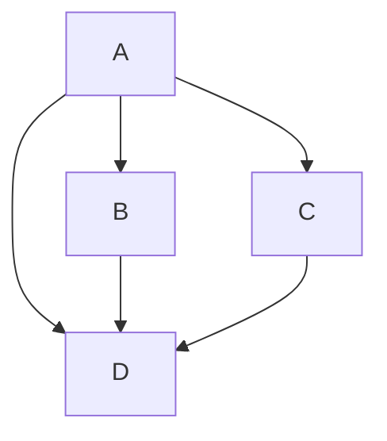

import Tabs from '@theme/Tabs';

import TabItem from '@theme/TabItem';

:::tip Use tabs in admonitions

<Tabs>
    <TabItem value="apple" label="Apple">This is an apple 🍎</TabItem>
    <TabItem value="orange" label="Orange">This is an orange 🍊</TabItem>
    <TabItem value="banana" label="Banana">This is a banana 🍌</TabItem>
</Tabs>

:::

